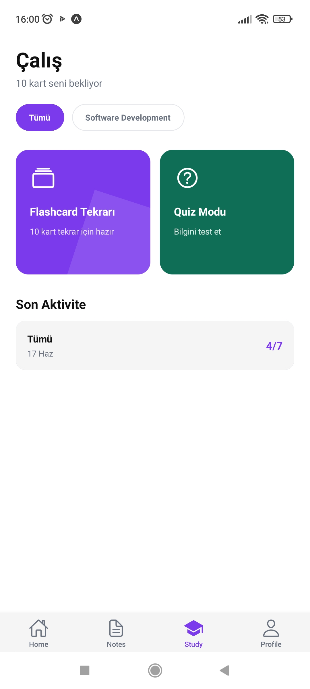
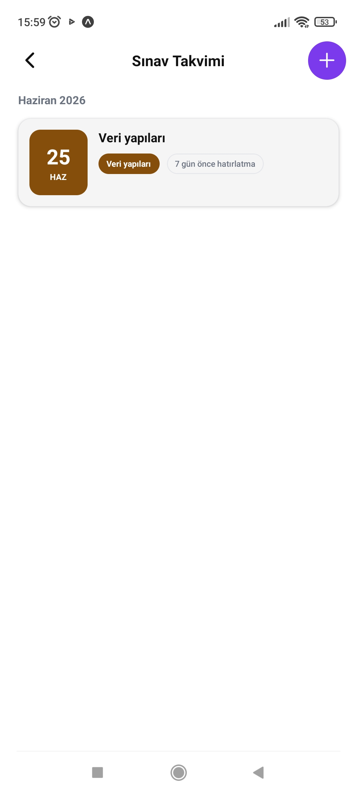
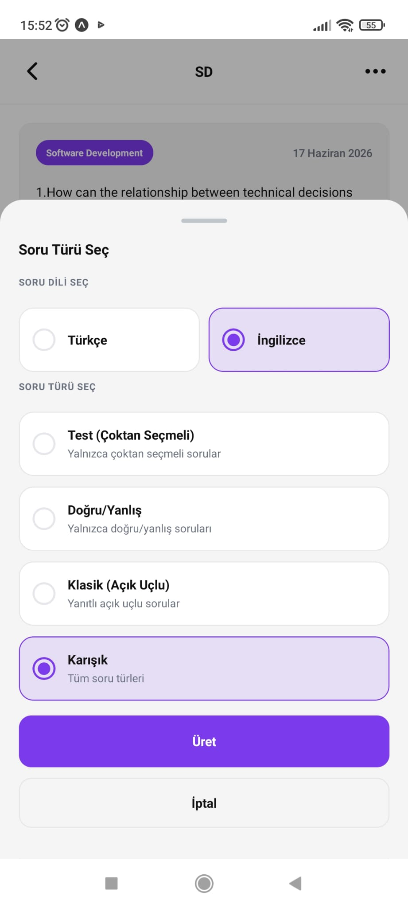
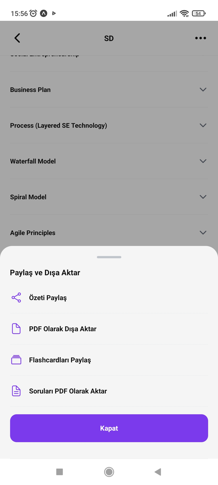
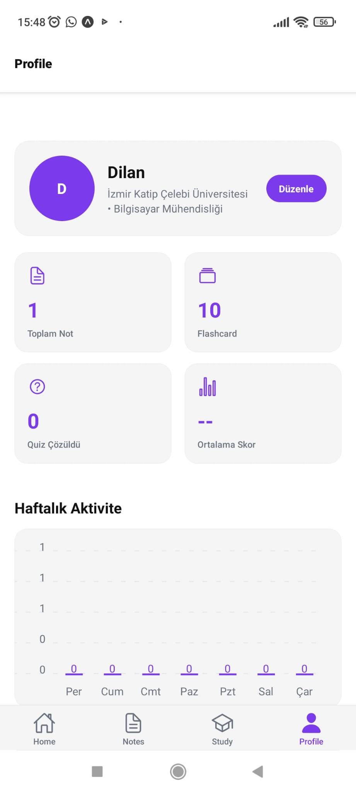
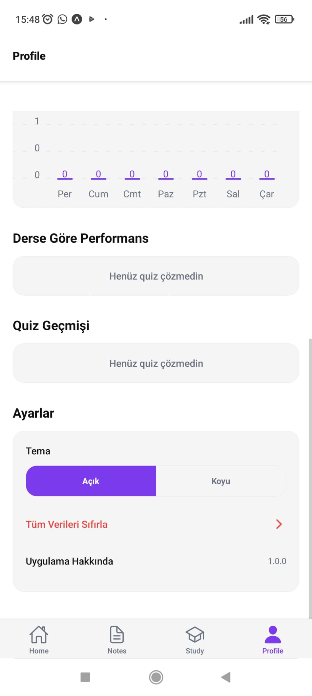

## NoteAI

AI-powered smart note assistant for students.

### Features
- Upload PDF or photos -> OCR text extraction
- AI summarization (overview, key concepts, important terms)
- Question generation (multiple choice, true/false, open-ended) with language selection (TR/EN)
- Flashcard creation with SM-2 spaced repetition
- Quiz mode with randomized answers
- Export notes and questions as PDF
- Exam calendar with push notifications
- Progress dashboard with weekly activity chart
- AI chat assistant per note
- Dark/light theme toggle
- Full data persistence (survives app restarts)

### Privacy & Data Storage
All user data, including notes, profile details, exam schedules, and quiz history, is stored locally on the device using AsyncStorage. Nothing is sent to or stored in a remote database.

Only the text needed for AI features is transmitted to Google's Gemini API during OCR, summarization, and question generation. That content is used temporarily for processing and is not retained by this application's backend.

### Tech Stack
- Frontend: React Native (Expo)
- Backend: Node.js + Express
- AI: Google Gemini 1.5 Flash (free tier)
- Storage: AsyncStorage (local persistence)
- State: Zustand

### Getting Started

**Requirements:**
- Node.js 18+
- Expo Go app on your phone
- Google Gemini API key (free at aistudio.google.com)

**Run:**
1. Clone the repo
2. npm install
3. cd backend && cp .env.example .env -> add GEMINI_API_KEY
4. cd .. && npm start
5. Scan QR code with Expo Go

### Screenshots

#### Home Screen - Study Mode

The main dashboard showing available study tools including Flashcards and Quiz Mode, with recent activity tracking.

#### Exam Calendar

View upcoming exams by month with detailed exam information and preparation status.

#### Question Details & Export Options

Detailed question view with sharing and export options including PDF export and flashcard creation.

#### Share & Export


Export and share generated study materials easily. Users can share summaries, export summaries as PDF, share flashcards, and export quiz questions as PDF for offline use and distribution.

#### User Profile

User profile showing statistics including total notes, flashcards, quizzes solved, and average score with weekly activity chart.


Profile settings page with theme customization and data management options.

```md
### Project Structure

| Directory | Description |
|------------|-------------|
| `src/screens` | Application screens |
| `src/components` | Reusable UI components |
| `src/navigation` | Tab and Stack navigation |
| `src/store` | Zustand state management with persistence |
| `src/services` | API service layer |
| `src/hooks` | Custom React hooks (`useAI`, `useAppTheme`, etc.) |
| `src/theme` | Colors, typography, and theme configuration |
| `backend/routes` | AI and OCR API endpoints |
| `backend/middleware` | Express middleware and error handling |
